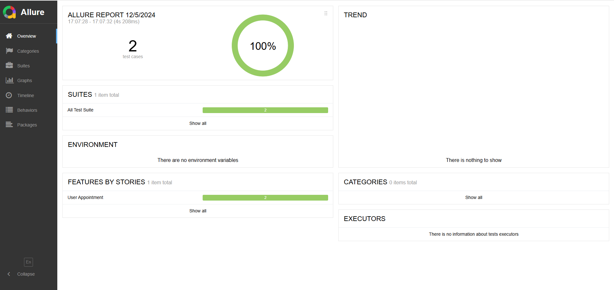
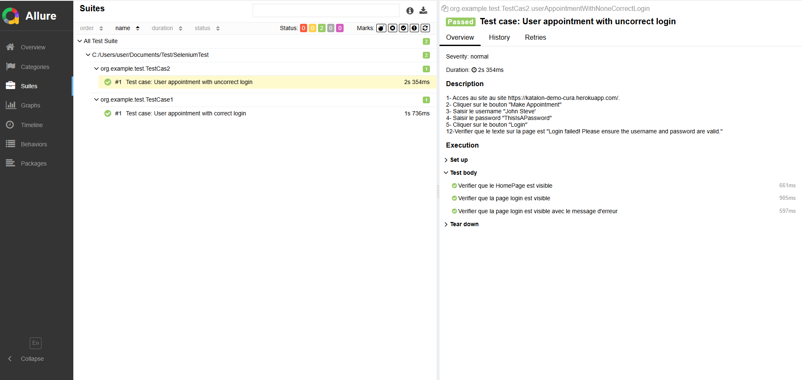
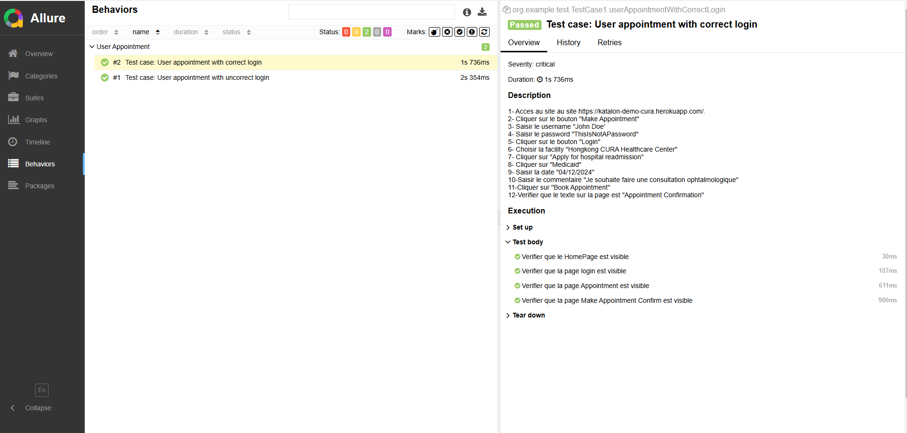
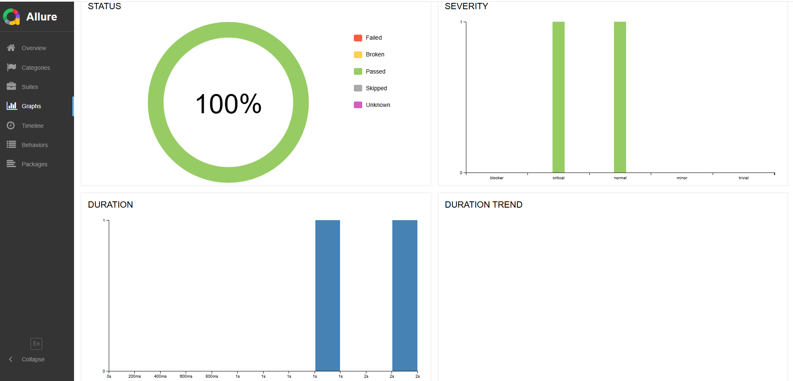

# Automation test Exercice
## About the Project

This project was implemented in order to practice automation test skill using Selenium (Java) framework.  
It has been done with a testing website for QA Autmation.  
The project verifies two test cases that are reported in Allure Report which describes in detail the activities performed and the statuses of each test.
It was an opportunity to learn the best practice as QA automation and improve my skills.
## Tools
* IntelliJ IDEA
* Maven
* Selenium Webdriver
* TestNG
*  Allure Report
## Project Design
* Page Object Model
* Fluent Interface
* Data-Driven approach
*  Behavior-Driven approach
## Report generated by Allure

In order to generate Allure Report follow these steps:  
* Install Allure Commandline: npm install -g allure-commandline --save-dev
* Generate report: allure serve target/allure-results
## The two test cases
### test case 1: User appointment with correct login
* Acces au site au site https://katalon-demo-cura.herokuapp.com/.
* Cliquer sur le bouton "Make Appointment"
* Saisir le username
* Saisir le password
* Cliquer sur le bouton "Login"
* Choisir la facility "Hongkong CURA Healthcare Center"
* Cliquer sur "Apply for hospital readmission"
* Cliquer sur "Medicaid"
* Saisir la date "04/12/2024"
* Saisir le commentaire "Je souhaite faire une consultation ophtalmologique"
* Cliquer sur "Book Appointment"
* Verifier que le texte sur la page est "Appointment Confirmation"
### test case 2: User appointment with uncorrect login
* Acces au site au site https://katalon-demo-cura.herokuapp.com/.
* Cliquer sur le bouton "Make Appointment"
* Saisir le username
* Saisir le password
* Cliquer sur le bouton "Login"
* Verifier que le texte sur la page est "Login failed! Please ensure the username and password are valid.
